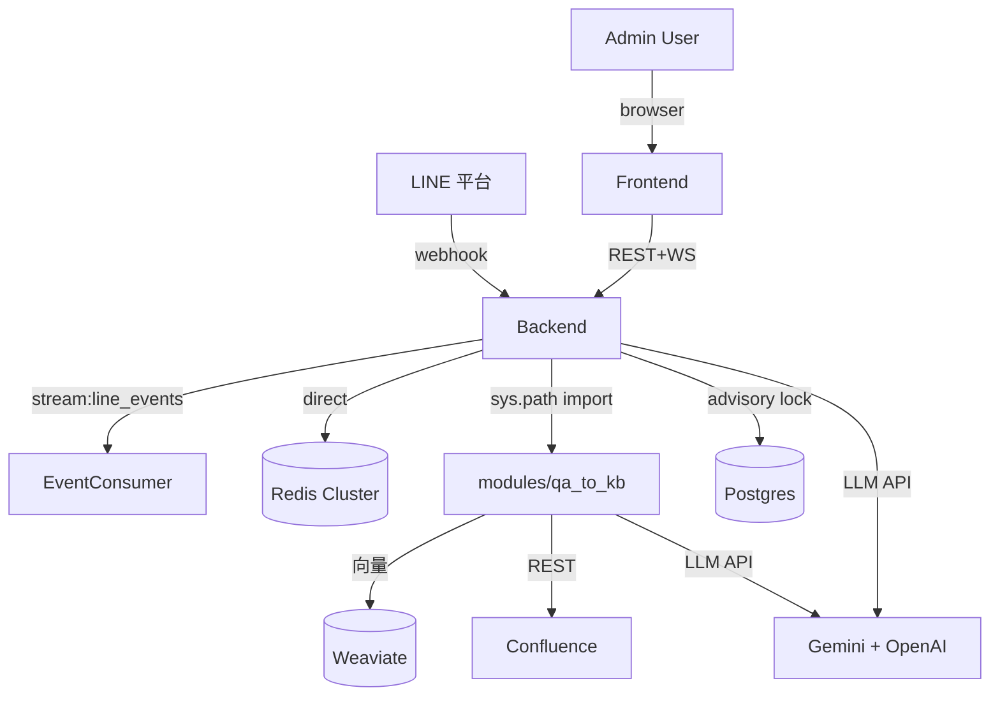
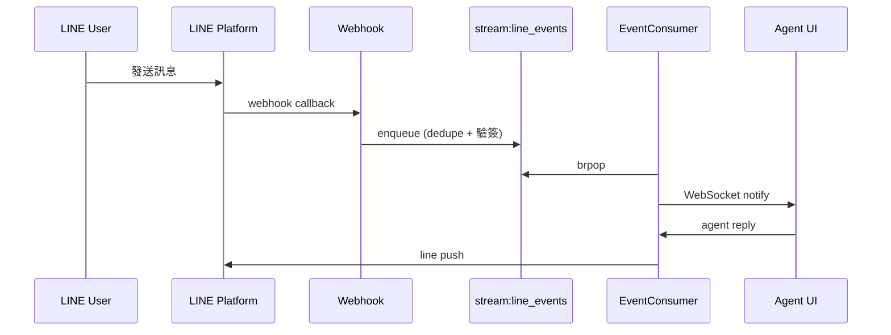

# obsidian-architect v4 — Consolidated Report Design Spec

**日期:** 2026-05-27
**狀態:** Draft — 等 user sign-off,之後進 writing-plans
**Branch:** TBD (建議 `feat/architect-v4-consolidated`)
**取代:** v3 的「14 個 fragmented 檔 + MOC overview」結構
**部分修正:** `/obsidian-roadmap` Phase 1 signal source(剔除 6 個將消失的檔)
**Layer:** Layer 1 (Vault Operations)

---

## 1. 動機 — MOC fundamentalism 的反省

v3 為了「給未來 Claude grep-friendly」把 overview 純化成 wikilink 索引,內容下放到 14 個檔(features / api-surface / decisions / roadmap / future / personas / jobs / flows / modules × 5)。

實際讀的時候 — 包括 user 自己 — 痛點變成:

- **沒人知道從哪裡開始讀**。Overview 是 MOC,沒故事;讀完 wikilinks 必須打開 14 個檔才能拼出全貌。
- **6 個檔重複或無用**:
  - `future.md` ↔ `roadmap.md` 高度重疊(已知限制 / 落差 / TODO 集群)
  - `jobs.md` 名實不符:H3 標題寫 JTBD 但 body 全是 friction points,讀起來像 bug list
  - `api-surface.md` 沒人類價值:列 46 個 URL 前綴 + count,讀完不知道任何 endpoint 做什麼
  - `features.md` 跟 overview 的「核心能力」段重複
  - `flows.md` 應該嵌進 overview 作為「系統怎麼動」的核心段,獨立檔造成 context-switch

v4 的核心轉變:**overview.md 變成自包含 top-down 報告**,detail 檔是「想深讀某段才打開」的延伸,不是「必讀才能拼出全貌」的散頁。

---

## 2. 目標

1. **Self-contained report.** Overview.md 打開一次,讀完從「為什麼存在 → 怎麼運作 → 哪裡缺 → 接下來改什麼」整個故事都有。
2. **真正 top-down 排序.** Purpose → System Layer → Stack → Capability → Flows → Modules → Improvements → Drill-down。從抽象到具體,沒回頭路。
3. **狠下心刪 6 檔**:`future.md`、`roadmap.md`、`jobs.md`、`api-surface.md`、`features.md`、`flows.md`。它們的有用內容遷移到 overview 或 modules 的 `## 改進機會`;沒用內容(api-surface 統計)直接丟。
4. **保留 4 類 detail 檔**:`modules/*.md`(深判斷,v3.1 tight bullets 不變)、`decisions.md`(技術決定 + ADR 候選 + 吸收 future 的 known-limitations)、`personas.md`(輕量使用者型態參考)、`overview.md`(主報告)。
5. **`/obsidian-roadmap` signal source 收斂**:Phase 1 只讀 overview + modules + decisions 的 `## 改進機會` block。
6. **遷移路徑安全**:tar.gz 整 Architecture/ 備份;v3 → v4 自動 delete 6 個檔但 `--dry-run` 先給 plan。
7. **Lang-aware.** 一切沿用 `_CLAUDE.md output-lang`。
8. **保留 `--frame=description` v2 fallback**(不動 v2/v3 行為)。

---

## 3. 不做的事

- **不重做 modules/*.md schema**。v3.1 tight bullets + 5 個 sentinel block(scope / strengths / weaknesses / improvements / dependencies)維持。
- **不重做 scanner**。Phase 1 deterministic scan 不動;只是 Phase 3+ 寫的檔少了。
- **不刪 personas.md**。它的內容(誰用這 product)是 overview 的 reference,留檔當輕量 detail。
- **不重做 lockfile 跨命令格式**。`_manifest.lock.json` schema bump v3 → v4,加 `frame: "report-v4"` 標記,sections entries 收斂到 overview / decisions / personas 三個。
- **不修 personas.py / personas signal collector**。它仍然有用(overview 引用 persona summary)。
- **不修 `compose_note`**。它的 frontmatter helper(`_repo_yaml_lines`)正確,留;只是 v4 呼叫它的 section types 變少。
- **不破 `/obsidian-roadmap` 整體 pipeline**。Phase 1 信號源縮、Phase 2-5 不變。

---

## 4. 最終 Architecture/ layout

```
Projects/<P>/Architecture/
├── overview.md            # ← 主報告 (~8-10 KB),8 段 top-down (見 §5)
├── modules/
│   ├── backend.md         # v3.1 深判斷 (不變)
│   ├── frontend.md
│   ├── modules.md
│   ├── scripts.md
│   └── services.md
├── decisions.md           # ← 技術決定 + ADR 候選 + 已知限制 (吸收 future.md 的 known-limitations)
├── personas.md            # ← 使用者型態 reference (精簡;不再 callout LLM-inferred warning,因為 overview 已 inline 主要 personas)
├── _manifest.yml          # 不動
└── _manifest.lock.json    # bump schema v3 → v4,加 frame marker

刪除:
├── future.md              # known-limitations 段併入 decisions.md;期望/落差段由 module Imps 取代
├── roadmap.md             # TODO clusters / commit trajectory 是 signal noise,真 roadmap 在 Projects/<P>/Roadmap.md (/obsidian-roadmap 產出)
├── jobs.md                # JTBD 變 overview 的 capability inventory;friction 變 module improvements
├── api-surface.md         # 統計沒人類價值;完整資料留 scan-report.json
├── features.md            # capability inventory 移入 overview §4
└── flows.md               # Mermaid sequences 移入 overview §5;friction 移入 module improvements

Total: 14 → 8 (overview + 5 modules + decisions + personas)
```

---

## 5. overview.md 的 8 段結構

### Frontmatter
```yaml
type: architecture-overview
moc-style: false               # 🆕 v4 反轉預設;這是 report,不是 MOC
report-style: true             # 🆕 新標記
date / project / local-path / commit / last-scanned / scanner-version
lang: zh-TW | en
tags: [architecture, codebase-doc, report]
ai-first: true
status: current
stack:                         # 直接嵌進 frontmatter,給 Dataview 用
  primary-language: ...
  frameworks: [...]
  test: ...
  build: ...
  deploy: ...
```

### Body (每段都包 `@generated` sentinel,refresh 不洗 user 加的 `@user` block)

```markdown
## 給未來 Claude
2-3 句說明:這份文件一次說完 langlive-line-oa 的整體設計。
若需深入某 module 的判斷與改進機會,打開 [[modules/<slug>]]。
若需完整技術決定,看 [[decisions]]。
若需使用者型態 reference,看 [[personas]]。


## 1. 這是什麼 / 為誰服務
<!-- @generated:start purpose -->
- **是什麼:** 一句話定義 (例:LangLive LINE Official Account 的 web 管理後台)
- **服務對象 (主要 personas):**
  - 客服管理員 — 看 dashboard、調度 agent、核准帳號
  - 客服 Agent — 第一線 ticket 處理
  - LINE 終端使用者 — 透過 LINE 與品牌互動
  - (其他見 [[personas]])
- **核心承諾:** (1-2 行,例:把多 channel 客服收進一個工作台,搭 AI 加速回覆)
<!-- @generated:end purpose -->


## 2. 系統架構圖
<!-- @generated:start system-diagram -->

<!-- @generated:end system-diagram -->


## 3. 技術棧
<!-- @generated:start stack-summary -->
- **語言:** Python 3.11 (backend) + TypeScript/JavaScript (frontend)
- **Frameworks:** FastAPI / React 19 / Vite 7 / LangGraph
- **資料層:** Redis Cluster (主) + Postgres (advisory lock + migration) + Weaviate (向量)
- **部署:** Docker 雙容器 (nginx port 8080 + FastAPI port 7860)
- **測試:** vitest + pytest;`make test-changed` 路由表
- **理由全文:** [[decisions#技術棧理由]]
<!-- @generated:end stack-summary -->


## 4. 核心能力 (What it does)
<!-- @generated:start capabilities -->
按 capability area 分群,每行 1-2 句 + 對應 module wikilink:

### Authentication & Admin Accounts
- 後台登入、bcrypt password hash、admin 帳號 CRUD + approve flow → [[modules/backend]]

### LINE Webhook & Ingest
- LINE 訊息進站、驗簽、dedupe、enqueue 到 stream:line_events → [[modules/backend]]

### Conversation Workspace (客服工作台)
- ticket 列表、對話歷史、reply 4 種類型 (text/image/file/video) → [[modules/backend]] + [[modules/frontend]]

### AI 自動回覆與輔助
- LangGraph 引擎產生 reply suggestion / auto-reply / KB 檢索 → [[modules/backend]] + 連 LLM API

### Knowledge Base / Question Center
- 客服對話 → AI 萃取 candidate → review → upload to Confluence + 索引 to Weaviate → [[modules/modules]]

### Admin Dashboard 與報表匯出
- /admin/snapshot / /admin/metrics / 報表 CSV/PDF → [[modules/backend]] + [[modules/frontend]]

### 平台運維 / 內部維護
- /internal/consumer/status、/redis/* 等 ops endpoints,EventConsumer health → [[modules/backend]]
<!-- @generated:end capabilities -->


## 5. 核心使用流程 (How it works)
<!-- @generated:start flows -->
3-5 個關鍵 flow,每個一個 Mermaid sequence + 2-4 個 friction bullets。

### Flow 1: LINE 客戶詢問處理 (主流程, GA)

**摩擦:**
- WebSocket 斷線時 `/active-handler/heartbeat` 失效,同事可能誤搶 ticket → 詳見 [[modules/backend#改進機會]] Imp 4
- 4 套 reply endpoint (`/reply-{text,images,files,videos}`) 不一致 → 詳見 [[modules/frontend#改進機會]] Imp 2

### Flow 2: KB candidate 產生與審核 (Beta)
```mermaid
sequenceDiagram
    ...
```
**摩擦:**
- QAToKBWorker 無 DLQ,exception 被吃掉 → [[modules/modules#改進機會]] Imp 1

### Flow 3-5: (依重要性挑 1-3 個額外 flow)
<!-- @generated:end flows -->


## 6. 模組地圖
<!-- @generated:start module-map -->
- **backend** — Python FastAPI + EventConsumer (single process). API + webhook + AI engine 集中。判斷詳見 [[modules/backend]]
- **frontend** — React 19 + Vite 7 SPA,nginx 部署。Admin dashboard / 工作台 / KB review。判斷詳見 [[modules/frontend]]
- **modules** — qa-to-kb 離線 pipeline (Redis queue worker)。對話 → KB 萃取 → Confluence。詳見 [[modules/modules]]
- **services** — Docker stacks (Postgres + Redis lab + Weaviate)。本地 dev 用。詳見 [[modules/services]]
- **scripts** — dev 工具 (`test_changed.py` 等)。詳見 [[modules/scripts]]
<!-- @generated:end module-map -->


## 7. 跨模組改進機會
<!-- @generated:start cross-cutting-improvements -->
Top 5 cross-cutting Imps (跨多 module 的設計問題)。Module-specific Imp 在 [[modules/*]] 內。

### Imp 1: 拆 EventConsumer 為獨立 worker container
- **為什麼:** API 與 EventConsumer 共用 process,流量峰值會互相影響
- **證據:** [[modules/backend#改進機會]] Imp 1, [[Flow 1#摩擦]]
- **Effort:** L
- **未做的風險:** 流量峰值客服 UI 延遲飆,LINE webhook backlog
- **Confidence:** medium

### Imp 2: 統一 reply endpoint 為單一介面
- **為什麼:** 4 套 endpoint 前端工作流不一致
- **證據:** [[modules/backend#改進機會]] Imp 3, [[modules/frontend#改進機會]] Imp 2
- **Effort:** M
- **未做的風險:** 媒體類型新增成本高,UI workflow drift
- **Confidence:** stated

... (3-5 個 Imps total)
<!-- @generated:end cross-cutting-improvements -->


## 8. 想深讀的入口
- **模組設計判斷:** [[modules/backend]] | [[modules/frontend]] | [[modules/modules]] | [[modules/services]] | [[modules/scripts]]
- **完整技術決定 + ADR 候選 + 已知限制:** [[decisions]]
- **使用者型態 reference:** [[personas]]
- **Curated Roadmap + Tasks backlog:** [[Roadmap]] (由 `/obsidian-roadmap` 產出)
- **完整 API 路由 + env var 機讀表:** `/tmp/architect-<hash>/scan-report.json` (per scan)

## 相關
- [[<project>]] (hub note)
```

---

## 6. decisions.md 變化

**保留** body sections:
- `## Summary`
- `## Stack rationale`
- `## Detected ADRs`
- `## Pattern decisions`
- `## Commit-message decisions`
- `## Promote to ADR`

**新增** body section (吸收原 future.md 的「已知限制」段):
- `## Known limitations` / `## 已知限制` — 從 future.md 遷移

寫入時:
- 首次 v4 跑到 v3 vault → migration 把 `future.md` 的 `## 已知限制` 段內容遷入 decisions.md 並刪檔
- Sentinel 新 block 名:`known-limitations`(原 future.md 的 sentinel 同名,內容可直接複製過去)

---

## 7. personas.md 變化

**保持** v3 內容 — 5 個 persona 的 Who/Goals/Touchpoints/Frequency/Pain points + LLM-inferred warning callout。

**移除** body 內過長的 pain points 列舉,因為 friction 已經移到 module improvements 或 overview 的 Flow 段。

Body 變得更精簡:per persona Who/Goals/Touchpoints/Frequency 為主,Pain points 只保留 1-2 條最高層次的。

---

## 8. 遷移:v3 → v4

### Migration helper

`scripts/architect/migration.py` 加新函式 `plan_v3_to_v4_migration(arch_dir)`:

```python
@dataclass
class V3ToV4Plan:
    files_to_delete: list[str]      # ["future.md", "roadmap.md", "jobs.md", "api-surface.md", "features.md", "flows.md"]
    files_to_keep: list[str]        # ["overview.md (will be rewritten)", "decisions.md", "personas.md", "modules/*"]
    user_blocks_to_carry: dict[str, list[tuple[str, str]]]  # filename -> [(block_name, content)]
    known_limitations_to_migrate: str   # content from future.md "## 已知限制" -> goes into decisions.md
```

Migration sequence:
1. **Backup**: tar.gz 整個 Architecture/ 到 `_archive/architecture-pre-v4-<timestamp>.tar.gz`
2. **Plan**: 列出要刪 6 檔、要保留 user blocks(若有)、要遷移 known-limitations
3. **ASK user** (除非 `--force`):proceed / dry-run / abort
4. **Apply**(`proceed` 路徑):
   - 把 future.md 的 `## 已知限制` 內容塞進 decisions.md 新 sentinel block
   - 刪 6 個 obsolete 檔
   - 重寫 overview.md(新 8 段結構)
   - 留 modules/*.md 不動(v3.1 tight bullets 仍正確)
   - 更新 lockfile schema 到 v4

### Lockfile v4

`_manifest.lock.json` schema bump from `version: 3` to `version: 4`:

- `frame: "report-v4"` 取代 `frame: "judgment-v3"`
- `sections` 收斂到 `{"overview", "decisions", "personas"}` 三個 entry(刪除 api-surface/features/roadmap/future/jobs/flows entries)
- `modules` 不動

---

## 9. /obsidian-roadmap 變化

Phase 1 signal source 從 v3 的「所有 architect 檔的 `## 改進機會`」收斂為:

- `overview.md` `## 跨模組改進機會` (1 個檔的 1 段 = 3-5 個 cross-cutting Imps)
- `modules/*.md` `## 改進機會` (5 個檔,每個 2-4 個 module-specific Imps)
- `decisions.md` `## Promote to ADR` (ADR-promotion 候選)

砍掉的 source:
- ~~`features.md` improvements~~ (檔不在了)
- ~~`flows.md` improvements~~ (檔不在了)
- ~~`future.md` known-limitations + gap-analysis~~ (已知限制變 decisions;落差/想法由 module Imps 取代)
- ~~`roadmap.md` TODO clusters~~ (signal-derived noise)

`scripts/roadmap/candidates.py` 改:
- `_extract_improvements_from_file` 只 walk 3 個 path(overview / modules/* / decisions)
- 保留 v2 fallback path(對沒遷移的 vault 仍 work)

---

## 10. 新 type schema 補充(進 `references/ai-first-rules.md`)

### `architecture-overview` 改動

新增 frontmatter:
- `report-style: true` — 區別 v3 的 `moc-style: true`
- `stack: {...}` — 既有 inline block 保留

新增 body section:
- `## 跨模組改進機會` / `## Cross-cutting improvements` — top-5 cross-cutting Imps

完整 body sections (en / zh-TW):
1. `## For future Claude` / `## 給未來 Claude`
2. `## Purpose & audience` / `## 這是什麼 / 為誰服務`
3. `## System diagram` / `## 系統架構圖`
4. `## Stack` / `## 技術棧`
5. `## Capabilities` / `## 核心能力`
6. `## Flows` / `## 核心使用流程`
7. `## Module map` / `## 模組地圖`
8. `## Cross-cutting improvements` / `## 跨模組改進機會`
9. `## Drill-down entries` / `## 想深讀的入口`
10. `## Related` / `## 相關`

### `architecture-api-surface` / `architecture-features` / `architecture-roadmap` / `architecture-future` / `architecture-jobs` / `architecture-flows`

標記為 **DEPRECATED**(保留 schema 文件以便讀舊 vault,但 v4 不再產出)。可在文件加 banner:

```markdown
> [!warning] DEPRECATED in v4
> 此 type 自 v4 起不再產出。內容遷移至:
> - `architecture-features` → `architecture-overview` `## 核心能力` 段
> - `architecture-flows` → `architecture-overview` `## 核心使用流程` 段
> - `architecture-future` → `architecture-decisions` 加 `## 已知限制` 段
> - `architecture-roadmap` → 砍掉,真正的 roadmap 由 `/obsidian-roadmap` 產出 `Roadmap.md`
> - `architecture-jobs` / `architecture-api-surface` → 砍掉,內容稀釋進 overview
```

### `architecture-decisions` 改動

新增 body section:
- `## Known limitations` / `## 已知限制`(吸收原 future.md 內容)

### `architecture-personas` 改動

無 schema 變化,純粹瘦身內容(pain points 大半移走)。

---

## 11. 命令 flag 變化

`commands/obsidian-architect.md` 既有 flags 保留。新增:

- `--frame=<judgment|description|report>` — default `report`(v4)。`judgment` 退回 v3 行為,`description` 退回 v2。
- `--keep-deprecated` — 不刪 6 個 obsolete 檔(讓 user 暫時雙寫;不推薦)

---

## 12. 檔案改動清單

| 檔 | 改動 |
|---|---|
| `commands/obsidian-architect.md` | Phase 3.5 大改:只產 overview/modules/decisions/personas;加 Phase 1.5 v3→v4 migration 步驟;`--frame=report` 預設 |
| `references/ai-first-rules.md` | `architecture-overview` 改 schema(report-style + 新 body sections);6 個 type 標 DEPRECATED;`architecture-decisions` 加 known-limitations;`architecture-personas` 瘦身 |
| `scripts/architect/sections.py` | `_BLOCK_NAMES["overview"]` 改成 v4 8 段;`SECTION_TYPES` 刪 6 個 deprecated entries(或標 deprecated);`compose_overview` 重寫 |
| `scripts/architect/migration.py` | 加 `plan_v3_to_v4_migration` + `apply_v3_to_v4_migration` + `migrate_known_limitations_to_decisions` |
| `scripts/architect/lockfile.py` | `CURRENT_SCHEMA = 4`,`frame: "report-v4"`,sections entries 收斂 |
| `scripts/architect/lang.py` | 加新 heading entries(`## 跨模組改進機會`、`## 想深讀的入口`、`## 核心能力`、`## 核心使用流程`、`## 模組地圖`、`## 這是什麼 / 為誰服務`) |
| `scripts/roadmap/candidates.py` | `_extract_improvements_from_file` 範圍縮到 overview/modules/decisions;保留 v2/v3 fallback |
| (刪) `scripts/architect/api_surface.py` / `api_surface_render.py` | 保留(scan-report.json 仍需 detector + 機讀資料);只是 vault 不再寫 api-surface.md |
| (刪) `scripts/architect/jobs.py` / `flows.py` / `personas.py` (jobs+flows) | `jobs.py` 跟 `flows.py` 函式變成 overview 內 sub-helper(回收為 `_render_capability_inventory_inline` / `_render_flow_inline`);`personas.py` 保留 |
| `tests/architect/` | 加 migration v3→v4 tests;`compose_overview` 新 schema tests;刪 jobs / flows / features / future / api-surface 寫入 tests(改為 deprecation tests) |
| `CHANGELOG.md` | 一筆 Unreleased,標 v4 consolidation |
| `SKILL.md` | 更新 architect 描述 |
| `README.md` | 更新 commands table 描述 |

---

## 13. Trade-offs 我有意識的

- **overview.md 變長 (~10KB)**:這恰恰是要求 — 一個檔講完故事。長但結構清晰,讀者不需要 context-switch。
- **6 個檔刪掉**:有人可能習慣去 `features.md` 找 capability list。Mitigation:overview.md `## 核心能力` 段就是。檔名變了但內容找得到。tar.gz 留 v3 整 tree 安全網。
- **`/obsidian-roadmap` Phase 1 signal source 縮**:不會少撿,因為 v3 的 6 個 deleted 檔的 improvements 已經在 modules + overview 的 `## 改進機會` block 重寫過。
- **modules/*.md 不動**:v3.1 tight bullets 風格正確。每個 module 仍是 5 段判斷 + 2-4 個 Imps。
- **decisions.md 變胖**:吸收了 future.md 的 known-limitations。但這個檔本來就是「技術 reference」,胖一點 OK。
- **`architecture-flows` type 退場**:有些人會喜歡 flows 獨立檔。但 user 明示要整合進 overview,且 v4 的核心是「打開 overview 看完整故事」 — flows 嵌入是這個目標的必要。
- **personas.md 留**:它是 reference,被 overview cite。砍掉的話 overview 必須完整列 5 個 persona,變太長。留 detail 檔給 lookup。

---

## 14. 驗收條件

對 langlive-line-oa 跑 `/obsidian-architect /Users/leric/Desktop/code/langlive-line-oa --refresh`(v4 frame)應該滿足:

- [ ] `Architecture/` 只剩 **8 個檔** (overview + 5 modules + decisions + personas) + lockfile + manifest
- [ ] `Architecture/_archive/architecture-pre-v4-<ts>.tar.gz` 存在(safety net)
- [ ] `overview.md` 含 8 個 body sections + 1 主 Mermaid + 3-5 個 flow sequence
- [ ] `overview.md` 5KB ≤ size ≤ 15KB(主報告範圍)
- [ ] `overview.md` `## 跨模組改進機會` 段含 3-5 個 Imps,每個 Imp 含 Why/Evidence/Effort/Risk/Confidence 五欄
- [ ] `decisions.md` 含 `## 已知限制` 段(從 future.md 遷移)
- [ ] **完全沒有** future.md / roadmap.md / jobs.md / api-surface.md / features.md / flows.md
- [ ] `_manifest.lock.json` `version: 4`,`frame: "report-v4"`,`sections` 鍵只有 overview / decisions / personas
- [ ] `Projects/<P>/langlive-line-oa.md` hub note `## 架構` 區塊更新到 v4(連 8 個檔)
- [ ] `/obsidian-roadmap langlive-line-oa` Phase 1 candidate 數 ≥ v3 的數的 80%(因為訊號源縮但 module Imps 沒少)
- [ ] `--frame=judgment` 退回 v3 行為(backward compat)
- [ ] `--frame=description` 退回 v2 行為
- [ ] 全測試通過 (`uv run pytest tests/`)
- [ ] Adapter build 通過 (`bash scripts/build.sh`),4 平台都產出

---

## 15. 開放問題

無。本 brainstorm 階段所有分岔已決:

- 收斂程度:A (14 → 7~8 檔) — 已核准
- overview.md 8 段 top-down 結構 — 已核准
- decisions.md 吸收 known-limitations — 隱含核准
- personas.md 留 + 瘦身 — 隱含核准
- 6 個 deprecated type schema 文件保留 + 標 DEPRECATED — 隱含核准
- Lockfile bump v3 → v4 + tar.gz backup — 隱含核准
- `/obsidian-roadmap` signal source 收斂 — 隱含核准
